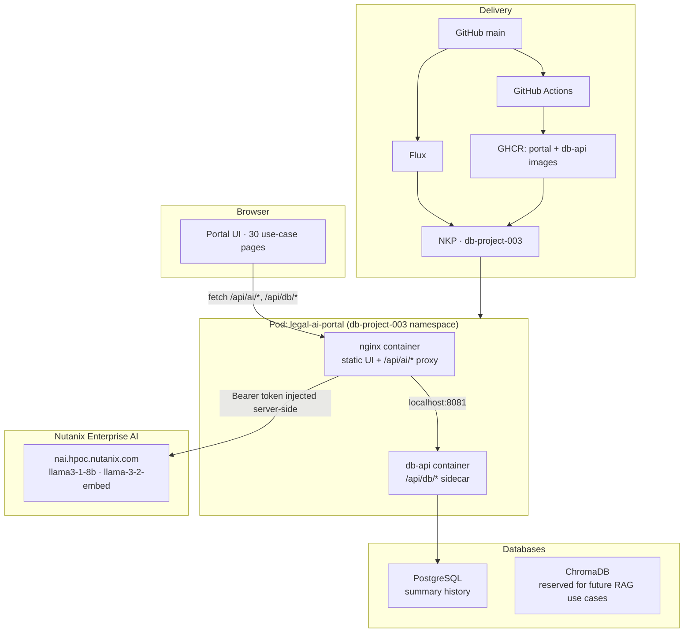

# Legal AI Portal

Nutanix Enterprise AI demo portal for the legal industry. 30 generative and
agentic AI use cases with 4 live demos, running on Kubernetes with nginx and
Nutanix AI inference.

GitHub repo: [script-repo/ucdemo-003-legal](https://github.com/script-repo/ucdemo-003-legal)
(source of truth for both the app and the cluster's desired state).

## Live Use Cases

| # | Use Case | Status |
|---|----------|--------|
| 01 | Contract Review & Analysis | Live |
| 02 | Legal Research | Live |
| 03 | Document Summarization | Live |
| 04 | Contract Risk Analysis | Live |
| 05–30 | [See full list](portal/use-cases/README.md) | PRDs ready |

## Architecture



- The browser never sees the Nutanix AI API key. nginx injects the
  `Authorization` header server-side, at container start, via envsubst —
  see [`nginx/default.conf.template`](nginx/default.conf.template).
- `db-api` is a sidecar in the same pod (not a separate Deployment) because
  nginx proxies `/api/db/*` to it over `localhost`.

## GitOps: GitHub → GHCR → Flux → NKP

There is no build/scp/podman step anymore. Push to `main` and the cluster
follows:

1. Push code (`portal/**`, `nginx/**`, `db-api/**`, `Dockerfile`) to `main`.
2. GitHub Actions builds `linux/amd64` images for `portal` and `db-api`,
   pushes immutable `sha-<commit>` tags to GHCR, and writes those tags into
   [`deploy/gitops/db-project-003/kustomization.yaml`](deploy/gitops/db-project-003/kustomization.yaml).
3. Flux (already running on the NKP cluster) polls this repo every minute
   and reconciles the overlay into the `db-project-003` namespace.

Full details, secret handling, and bootstrap steps:
[`deploy/gitops/README.md`](deploy/gitops/README.md).

```bash
git add -A
git commit -m "describe your changes"
git push origin main
# ...GitHub Actions builds + pushes images, updates kustomization.yaml...
# ...Flux reconciles within ~1 minute...
```

No secrets live in this repo. `NAI_API_KEY` and `PG_PASSWORD` are created
out of band as a Kubernetes Secret — see
[`deploy/gitops/README.md`](deploy/gitops/README.md#secrets--created-out-of-band-never-committed).

## Local Development

```bash
cp .env.example .env
# edit .env, set NAI_API_KEY to a real key
python -u server.py
# Portal at http://localhost:8080
```

`server.py` serves `portal/` statically, proxies `/api/ai/*` to Nutanix AI
(injecting the key from `.env`/the environment — never hardcoded), and backs
`/api/db/*` with a local SQLite file, mirroring the production Postgres API.
`.env` is gitignored; never commit a real key.

## Docs

| Document | Description |
|----------|-------------|
| [deploy/gitops/README.md](deploy/gitops/README.md) | GitOps deployment: flow, secrets, bootstrap |
| [docs/style-guide.md](docs/style-guide.md) | Visual design: colors, typography, components |
| [docs/SOFTWARE-SPEC.md](docs/SOFTWARE-SPEC.md) | Software specification: scope, infrastructure, security |
| [docs/PRD.md](docs/PRD.md) | Product requirements: goals, UX, feature list |
| [docs/Legal_AI_Architecture_Specification.md](docs/Legal_AI_Architecture_Specification.md) | Shared architecture for portal and all use cases |
| [portal/use-cases/README.md](portal/use-cases/README.md) | 30 use cases with individual PRDs |

## Project Structure

```
003-legal/
├── Dockerfile                      # portal image: nginx + static UI + AI proxy
├── nginx/
│   ├── nginx.conf                  # main config (no secrets)
│   └── default.conf.template       # server block; ${NAI_API_KEY} via envsubst
├── db-api/
│   ├── Dockerfile                  # db-api sidecar image
│   └── db-api.py                   # Postgres summaries REST API
├── server.py                       # local dev server (static files + AI proxy)
├── .env.example                    # copy to .env for local dev (gitignored)
├── .github/workflows/
│   └── publish-images.yml          # build + push both images, update GitOps tag
├── deploy/
│   ├── flux/
│   │   └── db-project-003-sync.yaml    # apply ONCE: GitRepository + Kustomization
│   └── gitops/
│       ├── README.md                   # deployment flow, secrets, bootstrap
│       └── db-project-003/              # live desired state (Flux reconciles this)
│           ├── kustomization.yaml
│           ├── namespace.yaml
│           ├── configmap.yaml
│           ├── deployment.yaml
│           ├── service.yaml
│           ├── postgres.yaml
│           └── chromadb.yaml
├── portal/
│   ├── index.html                  # main portal page
│   ├── app.js                      # card rendering, toggle menu, localStorage
│   ├── styles.css                  # portal styles
│   └── use-cases/
│       ├── 01-contract-review-and-analysis/
│       ├── 02-legal-research/
│       ├── 03-document-summarization/
│       ├── 04-contract-risk-analysis/
│       └── 05–30 (PRDs only)
├── scripts/                        # report/PRD generation helpers
└── docs/                           # architecture specs, PRDs, style guide
```
